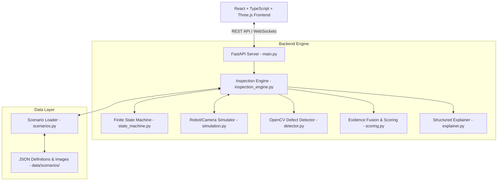
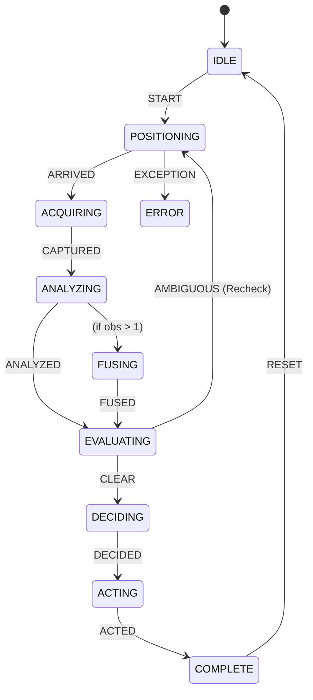

# AURA — Autonomous Inspection Intelligence

> **Autonomous, uncertainty-aware robotic PCB inspection platform combining computer vision, active reinspection, multi-observation evidence fusion, and a 3D digital twin interface.**


---

## Overview

**AURA (Autonomous Uncertainty-Aware Robotic Inspection Assistant)** is an industrial inspection cell framework engineered for printed circuit board (PCB) quality assurance.

Traditional machine vision systems rely on a single, fixed-view optical observation. When optical reflection, shadow, or subtle solder bridging creates ambiguous sensor evidence, single-view systems are forced to make a binary decision — resulting in false positives (unnecessary scrap) or false negatives (shipping defective hardware).

AURA solves this fundamental limitation through **active reinspection**:

> *"Instead of blindly deciding from a single observation, AURA recognizes when available evidence is insufficient, autonomously changes its physical inspection viewpoint, acquires a targeted close-up observation, fuses multi-view evidence, and renders a high-confidence final decision."*

---

## The Problem

Printed Circuit Board Assembly (PCBA) inspection faces distinct physical challenges:

1. **Optical Ambiguity**: Solder joints, traces, and SMD components create complex specular reflections depending on the incident light angle.
2. **Fixed-View Limitations**: Top-down orthogonal (0°) cameras cannot inspect under component leads or differentiate benign surface discoloration from genuine solder bridges.
3. **Scrap vs. Escapes Tradeoff**: Lowering defect thresholds increases false alarms (routing good boards to scrap), while raising thresholds risks escaping critical open circuits or solder shorts into production.
4. **Static Inspection Overhead**: Subjecting 100% of boards to full multi-angle physical scans wastes cycle time on defect-free boards.

Active reinspection resolves this by maintaining a high-throughput single-view path for clear cases (PASS/FAIL) and dynamically triggering targeted 3D camera re-positioning only when evidence falls into an ambiguous range.

---

## Our Solution

AURA structures inspection into an 8-stage closed loop:

$$\text{SENSE} \longrightarrow \text{ANALYZE} \longrightarrow \text{EVALUATE} \longrightarrow \text{RECHECK} \longrightarrow \text{FUSE} \longrightarrow \text{DECIDE} \longrightarrow \text{ACT} \longrightarrow \text{EXPLAIN}$$

```
┌─────────┐    ┌─────────┐    ┌──────────┐    ┌───────────┐
│  SENSE  │ ──>│ ANALYZE │ ──>│ EVALUATE │ ──>│ Ambiguous?│
└─────────┘    └─────────┘    └──────────┘    └─────┬─────┘
                                                    │
                                         ┌──────────┴──────────┐
                                        NO                    YES
                                         │                     │
                                    ┌────v────┐          ┌─────v─────┐
                                    │ DECIDE  │          │  RECHECK  │
                                    └────┬────┘          └─────┬─────┘
                                         │               ┌─────v─────┐
                                         │               │FUSE EVIDENCE│
                                         │               └─────┬─────┘
                                         │                     │
                                         v                     v
                                    ┌─────────┐           ┌─────────┐
                                    │   ACT   │ <──────── │ DECIDE  │
                                    └─────────┘           └─────────┘
```

1. **SENSE**: Virtual robot positions camera; optical sensor acquires direct top-down image.
2. **ANALYZE**: OpenCV classical computer vision pipeline compares target against reference template.
3. **EVALUATE**: Heuristic anomaly defect score evaluated against decision thresholds.
4. **RECHECK (Active)**: If score is ambiguous ($0.30 \le \text{score} \le 0.70$), system triggers viewpoint change.
5. **FUSE EVIDENCE**: Observation 1 (0° direct) and Observation 2 (35° angled close-up) are combined using weighted evidence fusion.
6. **DECIDE**: Evaluates fused score against final acceptance threshold.
7. **ACT**: Simulated robot routes PCB to production release or reject bin.
8. **EXPLAIN**: Generates audit reasoning list detailing score derivations and confidence metrics.

---

## What Makes AURA Different

| Feature | Description | Implementation Status |
| :--- | :--- | :--- |
| **Uncertainty-Aware Evaluation** | Evaluates clarity of signal before rendering final judgement. | **Implemented** (`backend/scoring.py`) |
| **Active RECHECK Loop** | Dynamically changes physical camera pose on ambiguous evidence. | **Implemented** (`backend/inspection_engine.py`) |
| **Multi-Observation Fusion** | Fuses primary and secondary observations via reliability weighting. | **Implemented** (`backend/scoring.py`) |
| **OpenCV Feature Extraction** | Extracts 7 feature metrics (intensity, ratio, edge discontinuity, contrast, etc.). | **Implemented** (`backend/detector.py`) |
| **Interactive 3D Digital Twin** | Renders 3D PCB slab, texture mapping, floor grid, and industrial camera model. | **Implemented** (`frontend/src/components/inspection/`) |
| **Precision Defect Focus** | 3D camera lerp focus + 2D magnified real image crop on exact defect BBox. | **Implemented** (`frontend/src/components/intelligence/`) |
| **Real-Time WebSockets** | Bi-directional state updates broadcast at each FSM state transition. | **Implemented** (`backend/ws_manager.py`) |
| **Robotic Hardware Interface** | Physical gantry motor controllers and hardware sensors. | **Simulated** (`backend/simulation.py`) |

---

## System Architecture



---

## End-to-End Inspection Pipeline

Each inspection lifecycle executes through modular Python services:

1. **Scenario Loading** (`backend/scenarios.py`): Loads scenario metadata, reference template (`template_image`), and test images (`test_images`).
2. **Inspection Initialization** (`backend/inspection_engine.py`): Generates UUID, initializes `Inspection` record and `StateMachine`.
3. **Positioning (Obs 1)** (`backend/simulation.py`): `VirtualRobot.move_to()` simulates gantry movement to 0° orthogonal pose (`X:150 Y:100 Z:300 mm`).
4. **Image Acquisition** (`backend/simulation.py`): `VirtualCamera.acquire_image()` fetches primary test image path (`data/pcb/test/...`).
5. **OpenCV Alignment & Differencing** (`backend/detector.py`): `cv2.absdiff(image, template)` computes pixel-wise absolute difference map.
6. **Thresholding & Filtering** (`backend/detector.py`): Applies Gaussian blur and binary thresholding (`cv2.threshold`) to isolate anomaly mask.
7. **Contour Extraction** (`backend/detector.py`): `cv2.findContours()` identifies candidate defect boundaries and derives `BBox(x, y, w, h)`.
8. **Feature Extraction** (`backend/detector.py`): Computes 7 quantitative metrics (`anomaly_score`, `anomaly_area_ratio`, `max_anomaly_intensity`, `edge_discontinuity`, `contrast_ratio`, `defect_count`, `sharpness`).
9. **Heuristic Defect Scoring** (`backend/detector.py`): Combines feature vector into primary defect score ($0.0 \le S \le 1.0$).
10. **Threshold Evaluation** (`backend/scoring.py`): Evaluates $S$ against initial bounds ($S < 0.30 \rightarrow \text{PASS}$, $S > 0.70 \rightarrow \text{FAIL}$).
11. **RECHECK Trigger** (`backend/state_machine.py`): If $0.30 \le S \le 0.70$, state transitions to `POSITIONING` with `recheck_count = 1`.
12. **Positioning (Obs 2)** (`backend/simulation.py`): Robot moves camera closer to target anomaly (`X:160 Y:105 Z:150 mm`, 35° angled close-up view).
13. **Second Image Acquisition** (`backend/simulation.py`): Acquires close-up inspection image.
14. **Secondary OpenCV Analysis** (`backend/detector.py`): Analyzes Observation 2 image, yielding secondary defect score.
15. **Evidence Fusion** (`backend/scoring.py`): `fuse_evidence()` computes weighted average of evidence items.
16. **Final Decision** (`backend/scoring.py`): Fused score evaluated against $0.45$ threshold, computing decision confidence percentage.
17. **Actuation** (`backend/inspection_engine.py`): Simulates routing action (`RELEASE TO PRODUCTION` vs `ROUTE TO REJECT BIN`).
18. **Broadcast & Explain** (`backend/explainer.py`): Emits `inspection_complete` payload over WebSockets with structured explanation list.

---

## Computer Vision Pipeline

The classical computer vision pipeline in `backend/detector.py` extracts structural PCB anomalies:

```
[Target Image] ──┐
                 ├──> [cv2.absdiff] ──> [GaussianBlur] ──> [cv2.threshold] ──> [findContours] ──> [Feature Extraction]
[Template Image] ┘
```

### Feature Extraction Metrics

- **`anomaly_score`**: Normalized mean intensity of difference map inside defect region.
- **`anomaly_area_ratio`**: Ratio of total anomaly contour pixels to reference image area.
- **`max_anomaly_intensity`**: Maximum peak difference pixel value ($0 \dots 255$).
- **`edge_discontinuity`**: Canny edge count difference along trace paths.
- **`contrast_ratio`**: Local region contrast variance.
- **`defect_count`**: Total discrete defect contours detected.
- **`sharpness`**: Laplacian variance measuring image focus quality.

### Defect Score Formula

$$\text{defect\_score} = \min\left(1.0, \; 0.4 \times \text{anomaly\_score} + 0.3 \times \min(1.0, \text{anomaly\_area\_ratio} \times 50) + 0.3 \times \min(1.0, \text{defect\_count} \times 0.25)\right)$$

> **Note on Terminology**: `defect_score` is a deterministic heuristic metric ranging from 0.0 to 1.0, **not** a calibrated probability distribution from a neural network.

---

## Uncertainty and RECHECK

AURA enforces strict decision thresholds during evaluation:

```
          PASS                    RECHECK                    FAIL
[ 0.00 ─────────── 0.30 ] [ 0.30 ─────────── 0.70 ] [ 0.70 ─────────── 1.00 ]
```

### Primary Thresholds (Observation 1)
- $\text{defect\_score} < 0.30 \longrightarrow$ **PASS** (Clear board, no further inspection required).
- $0.30 \le \text{defect\_score} \le 0.70 \longrightarrow$ **RECHECK** (Evidence ambiguous, trigger secondary observation).
- $\text{defect\_score} > 0.70 \longrightarrow$ **FAIL** (Severe defect, route to reject bin immediately).

### Fused Thresholds (After Observation 2)
When evidence is fused from multiple viewpoints:
- $\text{fused\_score} < 0.45 \longrightarrow$ **PASS**
- $\text{fused\_score} \ge 0.45 \longrightarrow$ **FAIL**

---

## Evidence Fusion

When a second observation is acquired, `backend/scoring.py` fuses evidence items using reliability weighting:

$$\text{fused\_score} = \frac{\sum_{i=1}^{N} \text{defect\_score}_i \times \text{reliability}_i}{\sum_{i=1}^{N} \text{reliability}_i}$$

### Reliability Factors
- **Observation 1 (0° Direct View)**: $\text{reliability}_1 = 1.0$ (Primary baseline perspective).
- **Observation 2 (35° Close-up View)**: $\text{reliability}_2 = 0.8$ (Targeted secondary view with slight angle distortion).

### Decision Confidence Calculation

$$\text{Decision Confidence} = \min\left(100\%, \; |\text{defect\_score} - 0.5| \times 2.0 \times \text{confidence\_boost}\right)$$

Where $\text{confidence\_boost} = 1.2$ for multi-observation fused decisions.

---

## 3D PCB Digital Twin Interface

The frontend (`frontend/src/`) provides an interactive 3D digital twin of the inspection cell built with **React 18**, **Three.js**, **React Three Fiber (@react-three/fiber)**, and **Drei (@react-three/drei)**.

```
┌─────────────────────────────────────────────────────────────────────────┐
│ AURA MISSION CONTROL                                       SYSTEM: ONLINE│
├──────────────┬──────────────────────────────────────────┬───────────────┤
│ SCENARIOS    │ DIGITAL INSPECTION CELL (3D R3F VIEWPORT)│ DECISION INTEL│
│              │                                          │               │
│ [RECHECK PATH]│      [Industrial Camera Twin]            │ FSM: COMPLETE │
│ Subtle Short │                 │                        │ Score: 0.403  │
│              │                 v                        │ Confidence:78%│
│ [PASS PATH]  │     ┌───────────────────────┐            │               │
│ Clean Board  │     │ 3D PCB Board Slab     │            │ OBS 1 ──┐     │
│              │     │ ┌ ┐ L-Brackets        │            │         ├──FUSED│
│ [FAIL PATH]  │     │ └ ┘                   │            │ OBS 2 ──┘     │
│ Open Trace   │     └───────────────────────┘            │               │
│              │  └─────────────────────────────────────┘ │ DECISION: FAIL│
├──────────────┴──────────────────────────────────────────┴───────────────┤
│ TIMELINE: POSITIONING ──> ACQUIRING ──> ANALYZING ──> FUSING ──> COMPLETE│
└─────────────────────────────────────────────────────────────────────────┘
```

### Key 3D Interface Features

1. **3D Rectangular PCB Slab** (`PCBBoard.tsx`): Renders 3D board geometry with dark green FR4 solder mask body (`#0e2b19`), metallic standoffs, and top face texture dynamically mapped to scenario inspection images.
2. **3D Inspection Camera Model** (`InspectionCamera.tsx`): Industrial camera housing with glowing lens ring and spotlight. Smoothly lerps between 0° direct top-down view and 35° close-up angled view during RECHECK positioning.
3. **Machine Vision ROI Markers** (`AnomalyMarkers.tsx`): Replaces screen clutter with 3D L-corner brackets `┌ ┐ └ ┘`. Bounding boxes mapped from pixel space $(X, Y)$ to physical board space $(X, Z)$.
4. **Precision Camera Focus** (`CameraFocusController.tsx`): Clicking any defect smoothly lerps OrbitControls target and camera position to focus directly on the physical defect region over 600–1200ms. Releases authority to OrbitControls (`minDistance=1.0`, `maxDistance=250`, `far=1000`) for manual zoom in/out.
5. **Magnified 2D Real Image Crop** (`DefectCropCanvas.tsx` & `DefectDetailPanel.tsx`): HTML5 Canvas crops actual physical inspection image around selected BBox with 35% padding, displaying exact pixel coordinates, area, and severity metrics.
6. **Keyboard Navigation**: Press `ESC` to return to overview; press `Left Arrow` / `Right Arrow` to switch defect targets.

---

## Scenarios

AURA includes three built-in test scenarios defined in `data/scenarios/`:

### 1. Clean Board — PASS Expected (`clean_board.json`)
- **Purpose**: Validates single-pass defect-free pipeline.
- **Expected Path**: `POSITIONING` $\rightarrow$ `ACQUIRING` $\rightarrow$ `ANALYZING` $\rightarrow$ `EVALUATING` $\rightarrow$ `DECIDING` $\rightarrow$ `ACTING` $\rightarrow$ `COMPLETE`.
- **Defect Score**: $0.000$.
- **Result**: **PASS** (Released to production in 1 observation).

### 2. Obvious Open Circuit — FAIL Expected (`obvious_defect.json`)
- **Purpose**: Validates instant failure detection for major structural flaws.
- **Expected Path**: `POSITIONING` $\rightarrow$ `ACQUIRING` $\rightarrow$ `ANALYZING` $\rightarrow$ `EVALUATING` $\rightarrow$ `DECIDING` $\rightarrow$ `ACTING` $\rightarrow$ `COMPLETE`.
- **Defect Score**: $0.985$.
- **Result**: **FAIL** (Routed to reject bin in 1 observation).

### 3. Subtle Solder Bridge — RECHECK Demo (`ambiguous_recheck.json`)
- **Purpose**: Demonstrates active reinspection and evidence fusion.
- **Observation 1 Score**: $0.253$ (Ambiguous near threshold).
- **Trigger**: System flags ambiguity $\rightarrow$ Robot moves camera to 35° angled pose $\rightarrow$ Observation 2 acquired ($0.591$).
- **Evidence Fusion**: Fuses Obs 1 ($0.253$) + Obs 2 ($0.591$) $\rightarrow$ Fused Score $0.403$.
- **Result**: **FAIL** (Routed to reject bin after 2 observations).

---

## State Machine

The FSM (`backend/state_machine.py`) governs inspection lifecycle transitions:



| State | Purpose |
| :--- | :--- |
| `IDLE` | System waiting for scenario selection and start signal. |
| `POSITIONING` | Robot gantry moving camera to target coordinates. |
| `ACQUIRING` | Optical sensor capturing PCB surface image. |
| `ANALYZING` | OpenCV pipeline computing difference map and contours. |
| `EVALUATING` | Evaluating defect score against thresholds. |
| `RECHECKING` | Active state indicating viewpoint change in progress. |
| `FUSING` | Combining multi-view evidence items using reliability weights. |
| `DECIDING` | Computing final decision and confidence score. |
| `ACTING` | Actuating physical/simulated routing mechanism. |
| `COMPLETE` | Inspection finished; results broadcast to UI. |
| `ERROR` | Exception caught; state halted safely. |

---

## Technology Stack

| Layer | Technology | Purpose |
| :--- | :--- | :--- |
| **Backend Runtime** | Python 3.12+ | Server execution environment |
| **API Web Framework** | FastAPI 0.111+ | REST endpoints & WebSocket server |
| **ASGI Server** | Uvicorn | High-performance asynchronous web server |
| **Computer Vision** | OpenCV (`opencv-python` 4.9+) | Image differencing, thresholding, contours |
| **Numerical Processing**| NumPy | Matrix and array manipulations |
| **Data Validation** | Pydantic v2 | Data schemas and API serialization |
| **Frontend Framework**| React 18.3 | User interface component framework |
| **Language** | TypeScript 5.4 | Type-safe client development |
| **Build System** | Vite 5.2 | Fast frontend bundler and HMR server |
| **3D Engine** | Three.js / React Three Fiber | WebGL 3D PCB & camera scene rendering |
| **3D Helpers** | @react-three/drei | OrbitControls, Html overlays, texture hooks |
| **State Management** | Zustand 4.5 | Client state store for inspection telemetry |
| **Server State** | TanStack React Query v5 | Async API query caching and mutations |
| **Styling** | Tailwind CSS 3.4 | Utility-first dark industrial theme |
| **Icons** | Lucide React | Technical UI iconography |
| **Schema Validation** | Zod 3.23 | WebSocket event payload validation |

---

## Repository Structure

```text
AURA-Autonomous-Inspection/
├── backend/
│   ├── config.py              # System constants and duration settings
│   ├── detector.py            # OpenCV computer vision anomaly detector
│   ├── explainer.py           # Structured reasoning generation
│   ├── inspection_engine.py   # Core engine orchestrating FSM & WebSocket broadcast
│   ├── main.py                # FastAPI web server and static file mounts
│   ├── models.py              # Pydantic & Dataclass domain models
│   ├── scenarios.py           # Scenario JSON loader utility
│   ├── scoring.py             # Threshold evaluation & evidence fusion algorithms
│   ├── simulation.py          # Virtual robot, camera, and sensor simulators
│   ├── state_machine.py       # Finite State Machine implementation
│   └── ws_manager.py          # WebSocket client connection manager
├── frontend/
│   ├── src/
│   │   ├── app/               # React App & QueryClient providers
│   │   ├── components/
│   │   │   ├── common/        # StatusBadge, TechnicalLabel, Metric components
│   │   │   ├── inspection/    # PCBScene, PCBBoard, InspectionCamera, AnomalyMarkers, CameraFocusController
│   │   │   ├── intelligence/  # DecisionPanel, SignalClarity, EvidenceFusion, DefectDetailPanel, DefectCropCanvas
│   │   │   └── layout/        # AppShell, TopBar, MissionSidebar, TimelineBar
│   │   ├── hooks/             # useInspection, useInspectionSocket custom hooks
│   │   ├── lib/               # API client, WebSocket manager, Zod schemas, utils
│   │   ├── store/             # Zustand inspectionStore
│   │   ├── styles/            # Tailwind globals.css
│   │   ├── types/             # TypeScript domain definitions
│   │   └── main.tsx           # React DOM root entry point
│   ├── index.html             # HTML entry point
│   ├── package.json           # Frontend npm package manifest
│   ├── tailwind.config.js     # Tailwind CSS configuration
│   ├── tsconfig.json          # TypeScript compiler configuration
│   └── vite.config.ts         # Vite bundler and proxy configuration
├── data/
│   ├── pcb/test/              # Inspection images (test images, heatmaps, diffs)
│   └── scenarios/             # Scenario JSON definitions (clean, obvious, ambiguous)
├── docs/                      # Project documentation and architecture specs
├── run.py                     # Root entry point script to run Uvicorn server
└── README.md                  # Project documentation
```

---

## Getting Started

### Prerequisites

- **Python**: 3.10+ (Python 3.12 recommended)
- **Node.js**: 18+ (Node v25 used in development)
- **npm**: 9+

---

### Installation & Setup

1. **Clone the repository**:
   ```bash
   git clone https://github.com/radhika-dev-23/AURA-Autonomous-Inspection.git
   cd AURA-Autonomous-Inspection
   ```

2. **Install Python Dependencies**:
   ```bash
   pip install fastapi uvicorn opencv-python numpy pydantic
   ```

3. **Build the Frontend Bundle**:
   ```bash
   cd frontend
   npm install
   npm run build
   cd ..
   ```

---

### Running the Application

#### Option A: Unified Server (FastAPI + React Dist)
Run the root launcher script. FastAPI will serve the built React frontend on port `8000`:
```bash
python3 run.py
```
Open **[http://localhost:8000](http://localhost:8000)** in your browser.

#### Option B: Development Mode (Vite Hot Reloading)
1. Start the Python FastAPI backend:
   ```bash
   python3 run.py
   ```
2. In a separate terminal, launch the Vite dev server:
   ```bash
   cd frontend
   npm run dev
   ```
Open **[http://localhost:5173](http://localhost:5173)** in your browser. API requests and WebSockets will proxy automatically to `http://localhost:8000`.

---

## License

This project is licensed under the **MIT License**.
